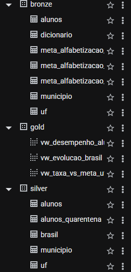
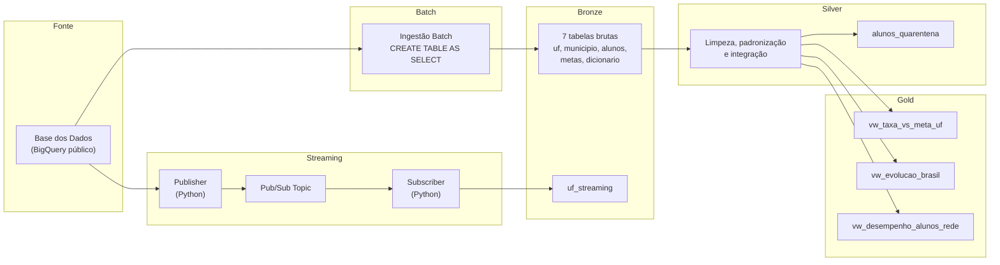

# Tech Challenge – Fase 2: Pipeline Híbrido para Análise da Alfabetização no Brasil

## 1. Contexto do Problema

A alfabetização na infância é um dos pilares fundamentais para o desenvolvimento educacional, social e econômico de um país. O Compromisso Nacional Criança Alfabetizada mobiliza União, estados, Distrito Federal e municípios para garantir que todas as crianças brasileiras estejam alfabetizadas até o final do 2º ano do ensino fundamental.

Com base na Pesquisa Alfabetiza Brasil (Inep, 2023), foi definido o ponto de corte de 743 pontos na escala de proficiência do Saeb como o nível a partir do qual uma criança é considerada alfabetizada. A partir desse parâmetro, foi criado o Indicador Criança Alfabetizada, que expressa o percentual de estudantes que atingem esse patamar. A meta nacional é alfabetizar 100% das crianças até 2030.

Este projeto constrói uma pipeline de dados híbrida (batch + streaming simulado) para integrar diferentes fontes relacionadas a esse indicador, permitindo análises sobre desigualdades educacionais e subsídio a políticas públicas baseadas em evidências.

## 2. Arquitetura da Solução

A pipeline segue a Arquitetura Medalhão, com três camadas:

- **Bronze (dados brutos)**: ingestão das 7 entidades da Base dos Dados via CREATE TABLE AS SELECT no BigQuery, preservando o histórico completo sem transformações, com carimbo de data de ingestão.
- **Silver (dados tratados)**: limpeza, padronização, tratamento de valores ausentes e integração entre UF, Município, Brasil e Alunos, com quarentena explícita de registros inválidos.
- **Gold (camada analítica)**: views prontas para consumo — taxa de alfabetização vs. meta por UF, evolução temporal nacional, e desempenho de alunos por rede de ensino — preparadas para dashboards, análises estatísticas e treinamento de modelos de machine learning.

## 3. Diagrama da Pipeline

## 4. Fluxo de Dados

1. Dados públicos são consultados diretamente no BigQuery público da Base dos Dados (sem necessidade de download manual).
2. **Batch**: as 7 entidades são copiadas para o dataset `bronze` do projeto via CTAS, com timestamp de ingestão.
3. **Streaming simulado**: um script publisher lê registros já existentes na Bronze e os publica em um tópico Pub/Sub, simulando chegada de novas medições; um subscriber consome as mensagens e grava em `bronze.uf_streaming`.
4. Na camada Silver, os dados de UF, Município, Brasil e Alunos são limpos, padronizados e integrados entre si; registros de alunos ausentes na avaliação são isolados em `alunos_quarentena`.
5. Na camada Gold, três views entregam indicadores prontos para análise: comparação taxa vs. meta, evolução temporal nacional e desempenho por rede de ensino.

## 5. Tecnologias Utilizadas

| Ferramenta | Uso no projeto |
|---|---|
| BigQuery | Data warehouse serverless para as camadas Bronze, Silver e Gold |
| Pub/Sub | Simulação de ingestão de eventos em tempo quase real |
| Python (google-cloud-pubsub, google-cloud-bigquery) | Scripts de publisher/subscriber do streaming simulado |
| Jupyter Notebook | Evidência documentada das validações de qualidade de dados |
| SQL analítico (GROUP BY, CASE, JOIN, COUNTIF) | Integração da Silver e construção das views da Gold |
| Git/GitHub | Versionamento, branches por camada e Pull Requests |

## 6. Decisões Arquiteturais (Trade-offs)

**Batch vs. Streaming**: a fonte de dados (Base dos Dados) é atualizada em ciclos anuais/bianuais, não em tempo real. Por isso, o batch é o mecanismo principal e funcional de ingestão, enquanto o streaming foi implementado como uma simulação declarada (Pub/Sub publicando e consumindo registros já existentes), demonstrando a capacidade arquitetural sem inventar uma fonte de eventos que não existe na realidade.

**Data Lake vs. Data Warehouse**: optou-se por usar o BigQuery em todas as camadas (em vez de combinar GCS para Bronze e BigQuery só para Silver/Gold). Isso simplifica a arquitetura, reduz a superfície de configuração e ainda é totalmente aderente ao conceito de data warehouse serverless, adequado ao volume de dados do projeto (dezenas de milhares de linhas).

**Custo vs. Performance**: preferiu-se `CREATE TABLE AS SELECT` para Bronze/Silver (dados que mudam pouco, vale materializar) e `VIEW` para a Gold (recalculada sob demanda, sem custo de armazenamento duplicado). Essa escolha prioriza custo baixo sobre performance de leitura, o que é adequado dado o volume pequeno de dados do projeto.

**Integração de chaves**: durante o desenvolvimento, identificamos que os campos `rede` nas tabelas de metas usam um vocabulário textual (`"Pública"`, `"Municipal"`) incompatível com o vocabulário numérico das tabelas de indicadores (`0` a `6`, conforme dicionário oficial da fonte). A integração foi ajustada para não depender desse campo como chave de junção, aplicando a meta de forma agregada. Essa é uma limitação da fonte de dados, não da modelagem do projeto.

## 7. Regras de Qualidade de Dados

Um notebook dedicado (`notebooks/validacao_qualidade.ipynb`) documenta as seguintes validações, com evidência de execução:

- **Duplicidade**: verificação de chaves compostas (ano+sigla_uf+serie+rede, ano+id_municipio+serie+rede, id_aluno+ano) — nenhuma duplicidade encontrada.
- **Valores ausentes**: contagem de nulos em campos críticos das tabelas Silver.
- **Validação de chaves de relacionamento**: confirmação de que os LEFT JOINs entre indicadores e metas não duplicam linhas.
- **Consistência entre tabelas**: verificação de cobertura de UFs (25 de 27 presentes na fonte) e de municípios sem meta correspondente.

Registros de alunos ausentes na avaliação (`presenca = 0`) são isolados na tabela `silver.alunos_quarentena`, seguindo o princípio de quarentena de dados inválidos.

## 8. Limitações Conhecidas da Fonte

- **DF e RR ausentes** na tabela `uf` de origem — limitação da própria fonte de dados, não resolvida na Base dos Dados.
- **Recorte "Total" (rede=0)** só está preenchido para a Bahia; para as demais 24 UFs, o recorte mais abrangente disponível é "Pública" (rede=5), usado como base da view `vw_taxa_vs_meta_uf`.
- **Meta de alfabetização 2024 ausente** para o Acre (AC) nos recortes Estadual, Municipal e Público — limitação pontual, não afeta os demais estados.
- Colunas `proporcao_aluno_nivel_0` a `_8` majoritariamente nulas em `uf`/`municipio` — característica da fonte, não preenchidas artificialmente.

## 9. Monitoramento e FinOps

**Monitoramento**: não implementado nesta entrega (item opcional do desafio). Como evolução futura, o projeto poderia usar Cloud Logging para rastrear falhas de ingestão e latência do pipeline de streaming.

**FinOps**: o projeto segue os três pilares de FinOps (Informar, Otimizar, Operar):

- **Informar**: o volume de dados manipulado (dezenas de milhares de linhas) permanece dentro da cota gratuita do BigQuery (1 TB de processamento e 10 GB de armazenamento por mês), resultando em custo próximo de zero.
- **Otimizar**: uso de CREATE TABLE AS SELECT para Bronze/Silver evita reprocessamento repetido; a camada Gold usa views, não tabelas materializadas, evitando armazenamento duplicado e mantendo os dados sempre atualizados sob demanda.
- **Operar**: separação em datasets por camada (bronze, silver, gold) permite aplicar políticas de retenção e